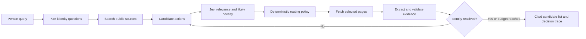

# People Search with Jev

**An implementation blueprint for source-backed search over public professional profiles.** Jev is the routing layer: it judges which candidate search or page-read action is likely to resolve an identity or add new evidence. Ordinary code performs the search, fetches pages, checks citations, and decides when to stop.

This repository contains the design, a small recorded routing trace, and a [24-second experiment video](assets/routing-experiment.mp4). It does **not** yet contain a working people-search service or a people-search benchmark. The recorded trace came from a public company-technology research task; it demonstrates the routing mechanism and motivates the next experiment without claiming that its results transfer to people search.

## What the experiment showed

A September 25, 2026 paired Linear research capture used one shared question plan and two independent routes. The Standard route followed provider order. The Jev route judged bounded candidate actions before choosing the next ones. Both used the same retrieval and evidence rules. [The public summary](evidence/linear-routing-example.json) contains only this example; earlier comparisons and raw run histories are not included here.

| Captured lane metric | Standard | Jev-guided |
| --- | ---: | ---: |
| Retrieval calls | 18 | 10 |
| Jev calls | 0 | 3 |
| Other model calls | 5 | 2 |
| All provider calls | 23 | 15 |
| Elapsed time | 74.4 s | 63.1 s |
| Known provider spend | $0.0915 | $0.0587 |
| Supported findings | 3 | 3 |

Shared planning took one additional model request, 13.6 seconds, and $0.0074 in known spend; it is excluded from both lane columns. Spend is the amount captured from provider reporting, not an end-to-end bill. This **single example** does not establish repeatable savings or equivalent answer quality. No human answer-comparability review was recorded.

The interesting moment is Jev's first decision. Of six candidate links, it selected three, including Linear's [developer page](https://linear.app/developers) and [multi-region engineering post](https://linear.app/now/how-we-built-multi-region-support-for-linear). The guided answer then cited Linear's own account of Cloudflare Workers routing in its multi-region deployment. Jev also selected one third-party article; selection is a proposed research action, not verification. The page still had to be read and its claims checked.

## The people-search task

Given a public professional query such as **“Find the engineering leader named Alex Chen at a robotics company in Boston”**, return a short list of candidate people, with:

- A visible identity decision: match, possible match, or insufficient evidence.
- Current role and organization only when a dated source supports them.
- Links and short excerpts for each claim, including when the source was retrieved.
- Explicit uncertainty for name collisions, stale profiles, and contradictory evidence.
- A trace of candidate actions Jev selected, deferred, or rejected.

The first version should use public professional pages only. It should not seek personal phone numbers, private email addresses, home addresses, family relationships, or information behind login walls. The output is a research aid, not an identity guarantee.

## Why Jev belongs here

People search has many plausible next actions: search the name plus a company, inspect a profile, check a conference bio, search an employer team page, or investigate a conflicting person with the same name. Search rank alone does not say which action best resolves uncertainty. Jev can answer bounded relevance and novelty questions about those actions; a deterministic policy then picks an allowed action and records why.

Jev is a typed decision model, not a prose generator. OpenRouter exposes `typesafe/jev-1.13` through its [Decisions API](https://openrouter.ai/blog/tutorials/how-to-use-jev/). A request supplies `state` and typed `questions`; the response supplies choices or scores with probabilities. The application must validate the response and own all execution, budgets, and fallback behavior. No separate TypeSafe key is required when Jev is called through OpenRouter. See the [model page](https://openrouter.ai/typesafe/jev-1.13/api) for the currently available model and pricing.

## Implementation contract

### Inputs and outputs

| Object | Required fields |
| --- | --- |
| `SearchRequest` | query, optional organization/location/role hints, result limit, request ID |
| `PersonCandidate` | stable ID, name, public profile URLs, source IDs, identity state |
| `Source` | URL, title, retrieved timestamp, publication/update timestamp if available, bounded text, source type |
| `Claim` | candidate ID, field, value, evidence excerpt and offset, confidence state, freshness note |
| `Action` | search query or public page URL, target identity question, provenance, eligibility, provider rank |
| `Decision` | state version, option IDs, Jev model ID, typed answers/probabilities, selected/deferred IDs, fallback reason |
| `Attempt` | provider, operation, dispatch status, duration, request ID, returned cost/usage if available |

Store snapshots and append-only events so the UI can replay what happened. Derive metrics from attempts, not from model text. Separate a *candidate URL* from a *read source*, and a *read source* from a *supported claim*.

### Retrieval and routing

1. Normalize the query into identity questions: **is this the same person?**, **what is their current role?**, and **which source supports each field?** Preserve user-provided constraints instead of guessing them.
2. Search the public web for several query variants. [Exa Search](https://exa.ai/docs/reference/search) can return links and, when requested, source highlights or text. Its [people search reference](https://exa.ai/docs/reference/verticals/people) describes a people index. Benchmark general search against the people category before fixing a default; category-specific filters and coverage differ. A provider adapter must allow replacing Exa without changing Jev or evidence logic.
3. Convert results and unanswered questions into a bounded queue of candidate actions. Deduplicate canonical URLs, reject unsafe destinations, and keep deferred actions eligible for a later wave.
4. Ask Jev to judge at most six actions per call for relevance to the identity question and likely new evidence. Pass short snippets and the current evidence gaps, not complete pages or secret credentials. Pin the requested model, record the model ID returned, validate answer types, and apply a deterministic selection policy. Low confidence or API failure falls back to an explicit safe order.
5. Fetch chosen public pages through a guarded server-side adapter with redirects, timeouts, content-size limits, and retry accounting. Never allow a model-returned URL to bypass URL policy.
6. Extract candidate identity facts with a separate generative model only when needed. Require exact source excerpts, check that quoted text occurs in stored content, and keep source interpretation separate from literal quotation. Jev's selection does not certify a page or claim.
7. Resolve identity only with enough independent signals (for example name plus organization and role or a direct cross-link). Conflicts reopen the question. An unresolved candidate stays visible as such.
8. Stop on resolved questions, exhausted eligible actions, a request budget, a deadline, or cancellation. Persist every dispatched attempt and accepted source even if work stops early.

### Suggested first build

Use TypeScript and a small Node worker. A web UI can submit work and replay events, while the worker owns the bounded loop. SQLite is sufficient for a single-host prototype. Keep `OPENROUTER_API_KEY` and any `EXA_API_KEY` on the server. A `.env.example` should contain variable names and empty values only. The implementation can start with a CLI and add the UI after the trace is correct.

| Milestone | Build | Acceptance check |
| --- | --- | --- |
| 1. Typed core | Request, person, source, claim, action, decision, attempt schemas; budgets and event log | Invalid provider or model output cannot enter stored state |
| 2. Standard route | Public search, guarded page fetch, identity evidence, deterministic provider-order baseline | One named-person query returns citations and unresolved conflicts |
| 3. Jev route | OpenRouter Decisions adapter, six-option shortlist, model pinning, fallback, stored probabilities | Fixture proves Jev changes an eligible next action; failures use the fallback |
| 4. Paired runner | Shared immutable query plan, independent lane caches, alternating execution order, exact usage accounting | Both routes are replayable and totals reconcile with attempts |
| 5. Inspection UI | Search form, candidate cards, source excerpts, live action graph, Jev decision replay | A reviewer can follow a claim back to the exact page excerpt |
| 6. Evaluation | Opt-in public-professional test set, human identity judgments, repeated paired runs | Report identity precision/recall, citation validity, coverage, latency, and known cost together |
| 7. Public demo | Sanitized recordings, short video, deployment with rate and access controls | No secrets or personal data in assets; fresh checkout passes all checks |

### Evaluation before any performance claim

Collect a consented or synthetic query set with ambiguous names, job changes, duplicate profiles, sparse evidence, and conflicting sources. Use identical plans and limits for both routes, separate caches, alternate order, and run enough repetitions to expose search variability. Human reviewers should judge identity correctness and material omissions without seeing the route label. Track wrong-person matches as a separate high-severity metric. Report retrieval and Jev calls, total provider calls, latency, known and unknown cost, source freshness, citation validity, and reviewer agreement. Do not turn a deferred action into a “call saved” metric.

### Privacy and failure boundaries

Restrict collection to public professional information relevant to the query. Respect source access controls and provider terms. Provide an easy way to remove a stored candidate, set retention limits for source text, and omit personal contact details from logs and public fixtures. Treat retrieved text as untrusted data. Keep model inputs bounded, HTML escaped, and credentials out of client bundles, logs, recordings, and exports. Rate-limit public submissions and retain enough events to explain failures without retaining unnecessary profile data.

## Repository contents

- [`evidence/linear-routing-example.json`](evidence/linear-routing-example.json): sanitized metrics, supported findings, and the first six-option Jev choice from one real routing capture.
- [`assets/routing-experiment.mp4`](assets/routing-experiment.mp4): 24-second Autumn AI experiment cut.
- [`assets/routing-experiment-cover.png`](assets/routing-experiment-cover.png): video cover.

There is no runnable people-search implementation in this repository yet. The first coding milestone is the typed core and CLI above. The video and trace are evidence of the routing experiment, not people-search performance data.
